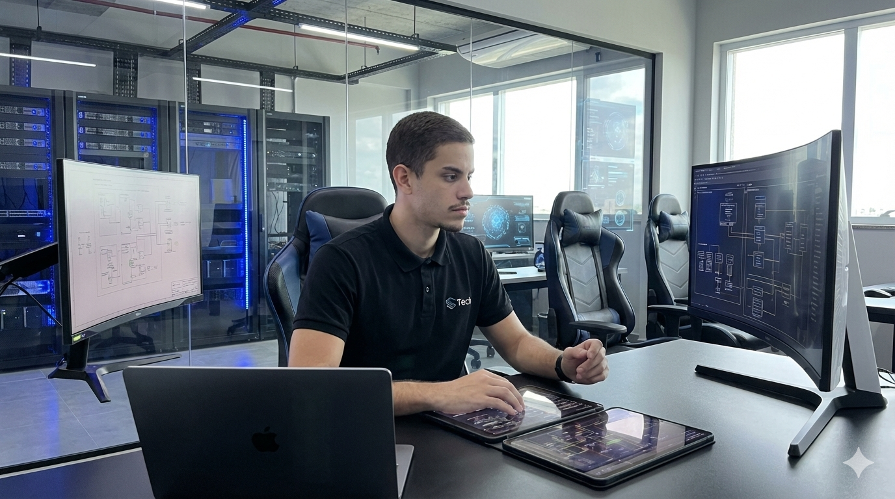

   
  

<h1>Olá, me chamo Gabriel! 👋</h1>
<h3>Desenvolvedor back end | Java | #OpenToWork 🚀</h3>

  
  

## 🧑‍💻 Sobre mim

- 🎓 Tecnólogo em Gestão da Tecnologia da Informação pela UNINTER  
- 💻 Estudando e praticando desenvolvimento back end com Java, Spring Boot e SQL  
- 🧠 Gosto de resolver problemas reais com código e entregar soluções web modernas e eficientes  
- 🚀 Estou sempre evoluindo, aprendendo e contribuindo com projetos impactantes  

 

---

## 💻 Tecnologias

<table>
  <tr>
    <td valign="top"><strong>🔣 Linguagens</strong> 
      
    </td>
    <td valign="top"><strong>🚀 Frameworks e Bibliotecas</strong> 
      
    </td>
  </tr>
  <tr>
    <td valign="top"><strong>🗃️ Banco de Dados</strong> 
      
    </td>
    <td valign="top"><strong>🛠️ Ferramentas</strong> 
      
    </td>
  </tr>
</table>

---

## 📊 GitHub Stats

  
    
  

---

## 🔥 Atividade recente

  
    
  

---

